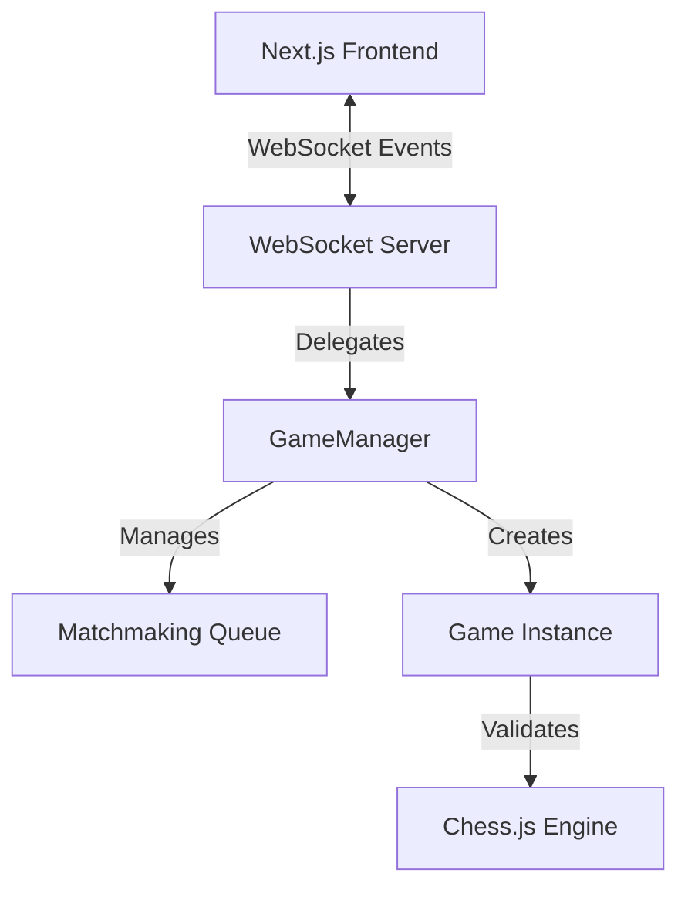
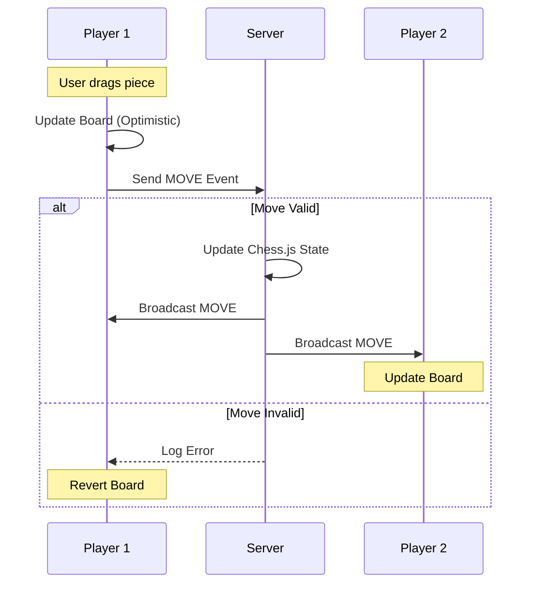

# ChessVerse: System Design & Architecture

**ChessVerse** is a modern, real-time multiplayer chess application built for high performance and seamless user experience. This document outlines the system architecture, core logic, and design principles behind the project.

## 🏗 System Architecture

The application follows a **Client-Server architecture** with real-time bidirectional communication.

### 1. Frontend Layer (`frontend_nxt`)
-   **Framework**: Next.js 16 (App Router).
-   **Role**: Handles UI rendering, user interactions, and client-side state prediction.
-   **Key Components**:
    -   `Game` Component: Manages the game loop and WebSocket connection.
    -   `ChessBoard`: Renders the board state and handles drag-and-drop events.
    -   `useSocket`: Custom hook for managing WebSocket lifecycle.

### 2. Backend Layer (`backend`)
-   **Runtime**: Node.js.
-   **Communication Protocol**: Native WebSockets (`ws` library).
-   **Role**: Authority on game state, matchmaking, and move validation.
-   **Key Classes**:
    -   `GameManager`: Singleton that handles user connections and matchmaking.
    -   `Game`: Represents a single active match, storing the `chess.js` instance for validation.

### System Diagram

---

## 🧠 Logic Implementation

### 1. Matchmaking Algorithm (FIFO)
The system uses a strict **First-In-First-Out (FIFO)** queue for pairing players.

1.  **User Connects**: A generic WebSocket connection is established.
2.  **`INIT_GAME` Event**: User requests to find a match.
3.  **Queue Check**:
    -   If `pendingUser` is `null`: The current user becomes the `pendingUser` and waits.
    -   If `pendingUser` exists: The current user is paired with `pendingUser`.
4.  **Game Start**: A new `Game` instance is created, colors are assigned randomly, and `INIT_GAME` is broadcast to both players with their respective colors.

### 2. Move Validation & Synchronization
To ensure integrity, all moves are validated on the server.

1.  **Client Move**: User makes a move. The frontend updates the board **optimistically** for instant feedback.
2.  **Server Validation**: The move is sent to the backend (`MOVE` event).
    -   The server attempts to make the move on its internal `chess.js` instance.
    -   **Invalid**: The move is rejected.
    -   **Valid**: The move is accepted.
3.  **Broadcast**: The server sends the validated move back to **both** players to ensure deterministic state synchronization.

### Data Flow: Make Move

### 3. Game Lifecycle
-   **Initialization**: Connection established -> Match found.
-   **Active Play**: Timer updates (managed by server timestamps) -> Move exchange.
-   **Termination**:
    -   **Checkmate/Stalemate**: Detected by `chess.js` on the server.
    -   **Resignation**: User sends `RESIGN` event.
    -   **Disconnection**: If a socket closes, the opponent is notified via `OPPONENT_DISCONNECTED` and awarded the win.

---

## 🎨 Design System

The UI is built with **Tailwind CSS v4** and follows a "Cyber-Chess" aesthetic.

-   **Color Palette**:
    -   **Background**: Deep Slate (`#0a0a0a` to `#171717`).
    -   **Accents**: Neon Emerald (`#10b981`) for active elements and winning states.
-   **Visual Effects**:
    -   **Glassmorphism**: Translucent panels with backdrop blur.
    -   **Glow**: Subtle shadows and lighting effects on interaction.
    -   **Responsiveness**: Fully fluid layout adapting to all viewport sizes.
